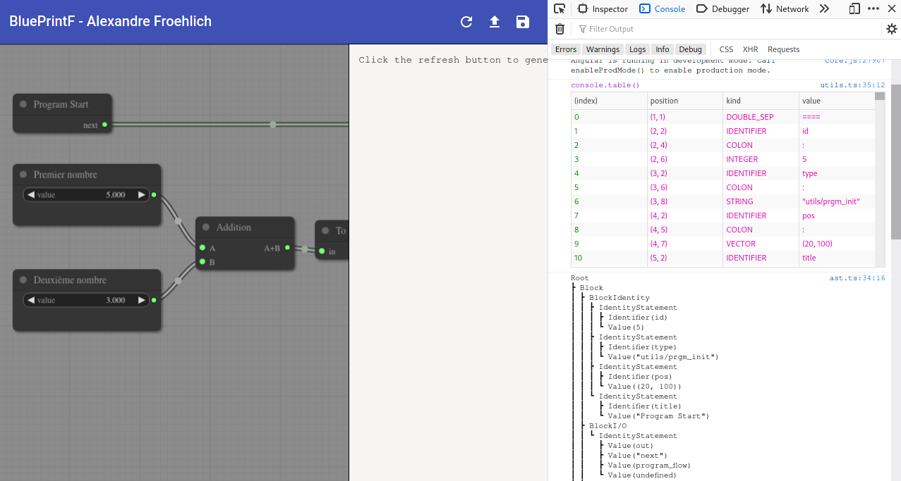
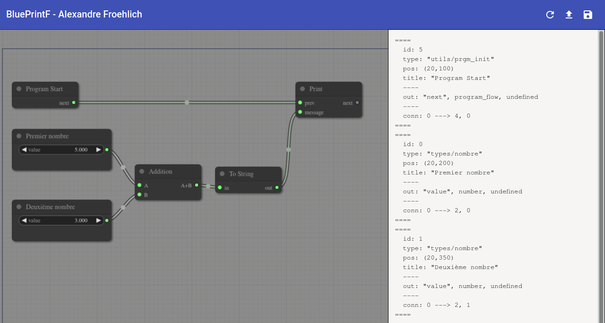
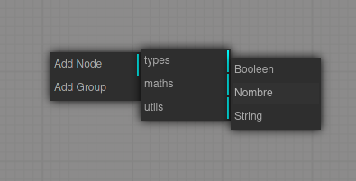

# Projet compilation : BluePrintF

> Conçu et développé par [Alexandre FROEHLICH](https://nightlyside.github.io/)
> ENSTA Bretagne - Architectures numériques - [Compilation](https://moodle.ensta-bretagne.fr/course/view.php?id=917)

## Introduction

Ce projet est le dernier dans le cadre du cours sur les architectures numériques. Pour ce projet plusieurs figures sont demandées :

-   un lexer
-   un parser
-   un AST
-   un visiteur

Chacune de ces étapes permet de prendre un texte ou un code en entrée puis de l'interpréter de manière à le compiler ou bien à le transformer dans un autre langage par exemple.

[BluePrintF](https://github.com/NightlySide/Typescript-Lexer-Parser/tree/blueprintf) est mon projet permettant de mettre tous ces concepts en oeuvre. Il permet à partir d'une interface intuitive de type "programmation visuelle" de créer des petits programmes qui seront par la suite compilés en Python 3.x.

## Utilisation de BluePrintF

La toute première chose à savoir est que ce projet étant en Typescript et fonctionnant sur le web à cette addresse : [https://nightlyside.github.io/Typescript-Lexer-Parser/](https://nightlyside.github.io/Typescript-Lexer-Parser/), donc on obtient les logs uniquement à l'aide de la console développeur du navigateur.

> Pour ouvrir la console navigateur le raccourci `Ctrl + Shift + I` est bien utile

L'interface se présente en deux partie :

A gauche le graph permettant de créer, modifier, relier et déplacer les blocks. A droite se trouve la sortie du programme selon la fonction demandée.

On retrouve en haut 3 boutons permettant dans l'ordre de gauche à droite :

1. Générer le code python depuis le graph
2. Uploader une configuration (au format .vpy) existante
3. De sauvegarder le graph actuel pour le charger plus tard

Dans le graph un click droit sur un block permet d'accéder à la plupart de ses informations comme pour changer le titre par exemple. Pour ajouter un nouveau block il suffit de cliquer droit dans un espace vide puis de suivre les catégories comme suit :

> **/!\\ Attention :** pour fonctionner le programme doit avoir un **unique** block "Program Start". Dans tous les cas le compilateur se chargera de vérifier cette condition.  
> De même pour qu'un ensemble de blocks apparaissent dans le code python, il sera nécessaire de les rejoindre à l'aide du flux "program flow" (indiqué par les ports "next").

## Emplacement des livrables

Ce projet étant relativement complexe avec une IHM très lourde (Angular) voici les endroits où vous pourrez retrouver les livrables demandés.

### Le compilateur

> Emplacement: `/src/compiler/`

Le dossier compilateur comprend deux fichiers de définition.

Un fichier `kinds.ts` comprenant l'ensemble des Tokens à disposition.

Un fichier `types.ts` comprenant l'ensemble des types customs nécessaires au compilateur (Token, Word, Kind, etc...)

### Lexer

> Emplacement: `/src/compiler/lexer`

Le lexer est composé de 3 fichiers, un fichier pour le fonctionnement du lexer, un fichier contenant les règles RegExp correspondant à tous les tokens et un fichier utils pour les fonctions pratiques du lexer.

### Parser

> Emplacement: `/src/compiler/parser`

Le parser comprend le fichier `parser.ts` avec la classe permettant de parser la sortie du lexer.

Il comprend aussi un fichier `grammar.ts` contenant l'ensemble de la grammaire du langage de description que j'utilise.

### AST

> Emplacement: `/src/compiler/ast`

L'Arbre de Syntaxe abstraite comprends le fichier `ast.ts` avec la logique de fonctionnement de l'AST.

Il comprend aussi un fichier `types.ts` décrivant l'ensemble des classes créer pour l'AST (Node, etc...).

### Visiteur

> Emplacement: `/src/compiler/visitor`

Le visiteur est composé d'une première classe de base : `visitor.ts` ainsi que d'un deuxième fichier avec une autre classe implémentant le pattern visiteur pour faire l'affichage de l'arbre `pretty_printer.ts`.

### IHM

> Emplacements :
>
> -   `/src/app/graph`
> -   `/src/app/upload_modal`
> -   `/src/app`

L'IHM a été réalisée avec Angular, un framework Typescript pour réaliser de grosses applications.

Après l'avoir essayé je préfère tout de même React qui me parait plus flexible que Angular.

L'upload de fichier se fait en copiant/collant le texte vu que je ne peux pas uploader de fichiers comme ça vers le serveur github.

## Conclusion

Ce projet m'a demandé beaucoup de temps pour réaliser l'IHM. Si c'était à refaire, je ne le ferais cependant pas différemment. En effet ce projet se base entièrement sur la programmation visuelle. Le reste vient ensuite malheureusement. C'est pourquoi il manque des fichiers de tests voir même des fonctionnalités qui pourraient être implémentées facilement vu que le code est déjà présent.
